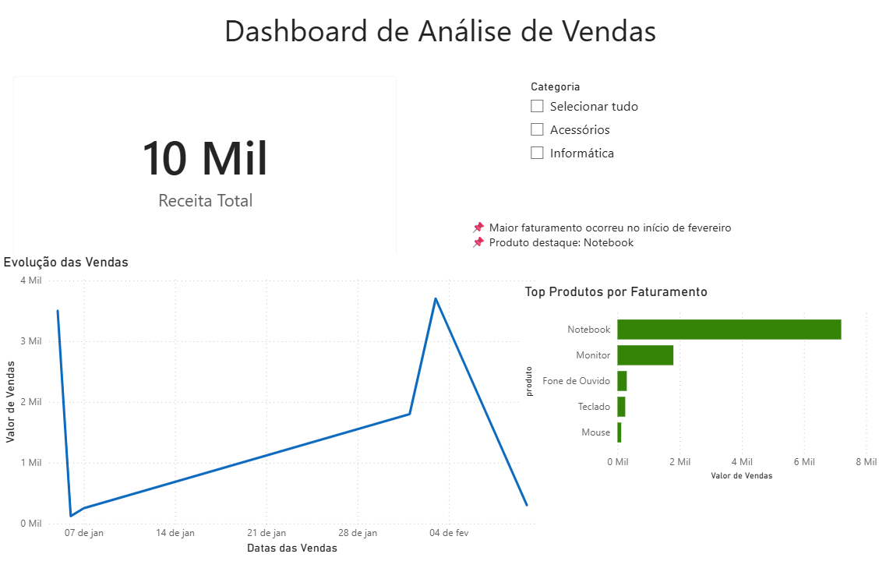

# 📊 Análise de Vendas com Python e Power BI

## 🎯 Objetivo
Este projeto tem como objetivo analisar dados de vendas para identificar padrões
de faturamento, produtos mais relevantes e apoiar decisões de negócio.
O foco é aprendizado prático e construção de portfólio para vagas de
Analista de Dados Júnior em regime Home‑Office.

---

## 🧠 Perguntas de Negócio
- Como as vendas evoluíram ao longo do tempo?
- Quais produtos geram maior faturamento?
- Existem oportunidades de foco estratégico?

---

## 🛠 Tecnologias Utilizadas
- Python
- Pandas
- Matplotlib
- Jupyter Notebook (VS Code)

---

## 📈 Principais Análises
- Análise temporal da evolução das vendas
- Identificação dos produtos com maior faturamento
- Visualização gráfica para apoio à tomada de decisão

---

## ✅ Conclusões
- As vendas apresentam variação ao longo do tempo
- Um pequeno grupo de produtos concentra grande parte da receita
- A análise pode apoiar decisões estratégicas de negócio

---

## 📁 Estrutura do Projeto

analise-vendas/
│
├── data/
│   └── vendas.csv
├── analise_vendas.ipynb
└── README.md

## 📊 Dashboard Power BI

Este dashboard permite explorar os dados de forma interativa, facilitando a identificação de padrões e insights de negócio.

📁 Arquivo Power BI disponível:
[Download do Dashboard](dashboard/dashboard_vendas.pbix)

---

## 👤 Autor
Jefferson Aloisio Ferreira Silva  
Bacharel em Sistemas de Informação  
Pós‑Graduado em Ciência de Dados e Big Data Analytics  
Certificação em IA – Escola de IA Estácio
